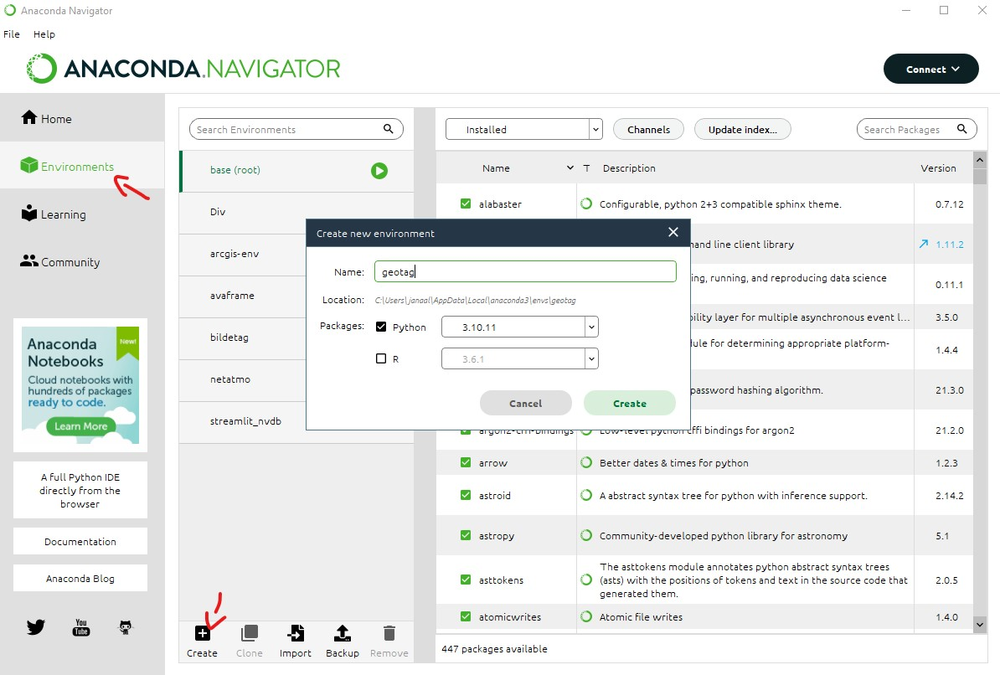
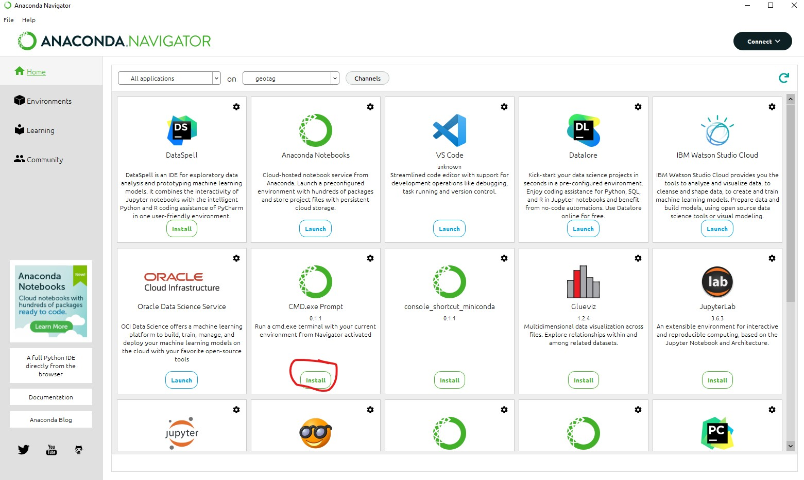
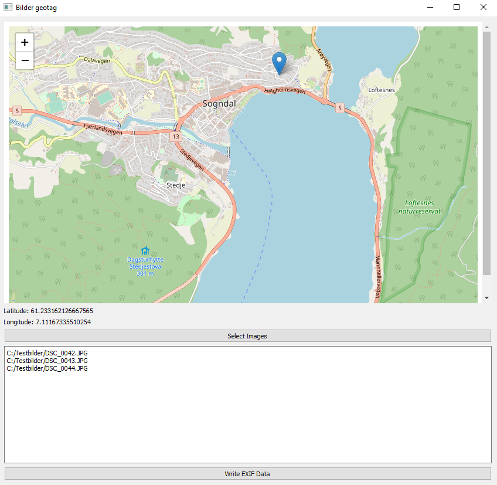

# Geotagg bilder
Enkel liten PyQt5 app som lar deg geotagge valgte bilder i ei mappe

Appen nyttar biblioteka pyqt5 og piexif, desse må installerast før appen kan brukes.

Det enkleste er å bruke Anaconda til å lage nytt virtual enviroment:





Installere cmd, og kjøre kommandoene under:

```
pip install pyqt5 piexif
```

Fila pyqt.py må så lastes ned, og fra mappa der denne fila ligger kjøres kommandoen:

```
python pyqt.py
```
Appen brukes ved å først velge eit punkt i kartet, for så å velge bildene fra ei mappe som skal få koordinat for punktet.


